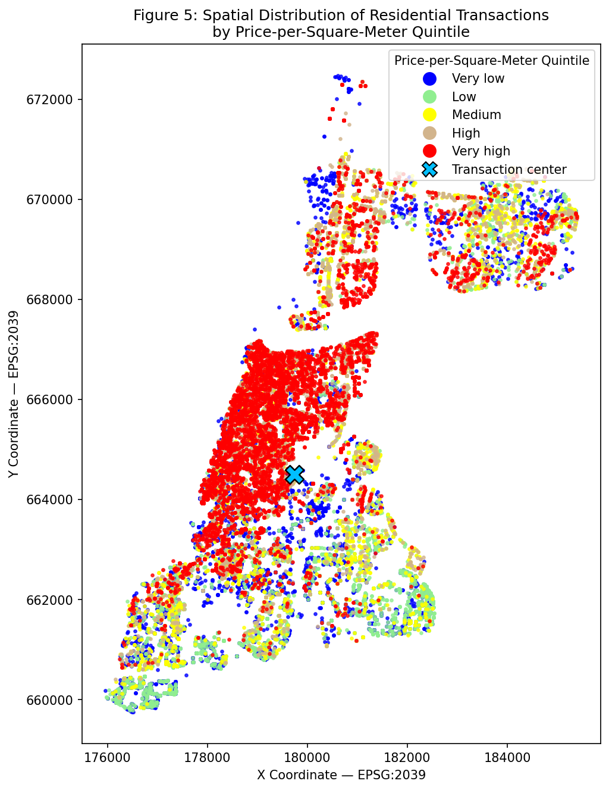
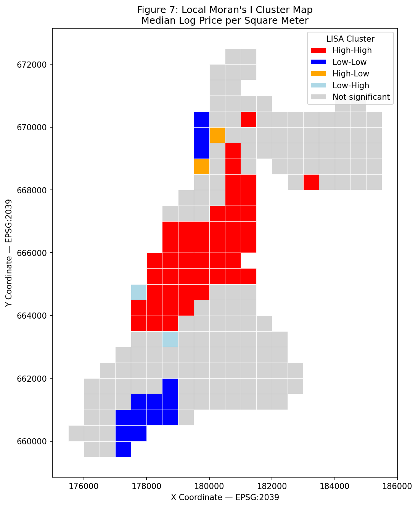
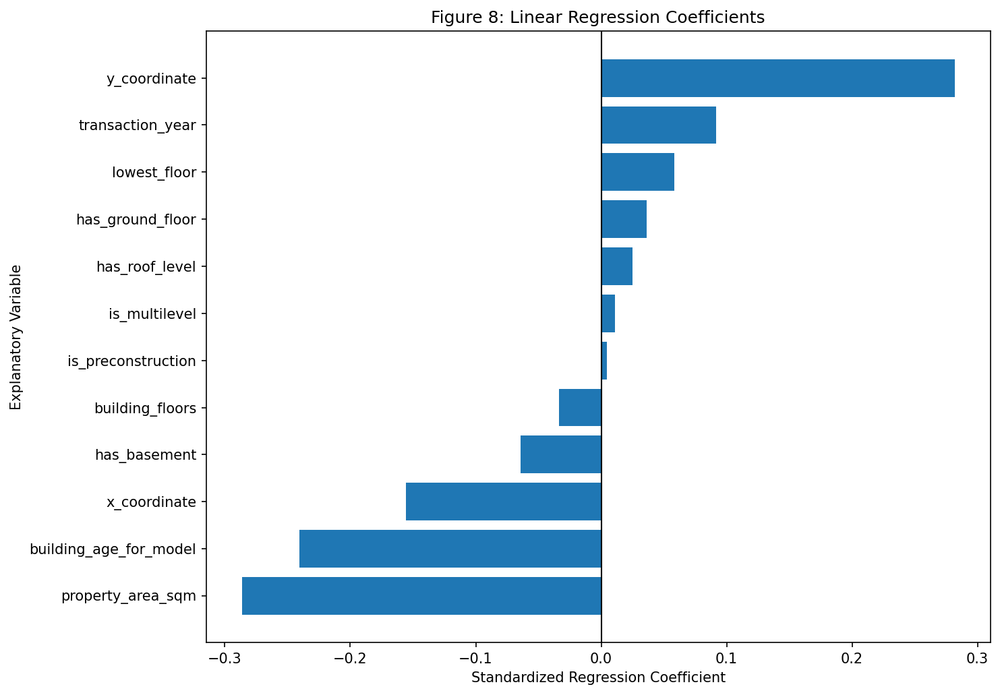
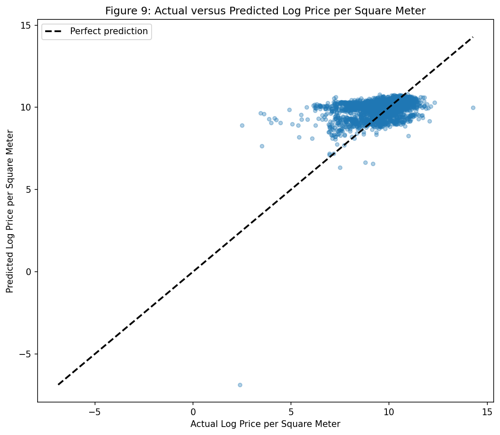

# Tel Aviv Real Estate: Spatial Data Analysis & Price Modeling

A data-science portfolio project analyzing **37,000+ real-estate transactions in Tel Aviv (2012–2017)** to explore how property characteristics and geographic location are associated with price per square meter.

## Project overview

The project combines data cleaning, exploratory analysis, geospatial processing, spatial statistics, and machine learning.

**Research question:**
> How are property characteristics and geographic location associated with price per square meter in Tel Aviv?

## Skills demonstrated

- Python
- Pandas and NumPy
- Data cleaning and feature engineering
- Exploratory data analysis
- Matplotlib and Seaborn
- GeoPandas
- Spatial analysis with PySAL
- Global Moran's I and Local Moran's I (LISA)
- Scikit-learn
- Multiple linear regression
- Spatially grouped train/test splitting
- Model evaluation and sensitivity analysis

## Dataset

The original dataset contains **37,358 real-estate transactions** in Tel Aviv from 2012 to 2017, including transaction price, property area, building year, floor information, number of floors, and ITM coordinates.

After applying basic validity filters and restricting the analysis to residential transactions, the main analytical sample contains **36,495 transactions**.

The raw dataset is not included in this repository. The notebook expects a file named `tel_aviv_real_estate.xlsx` in the project directory.

## Workflow

1. **Data preparation** — standardized variables, created price-per-square-meter and building-age features, and identified pre-construction transactions.
2. **Floor-description parsing** — cleaned inconsistent Hebrew floor descriptions and extracted structured floor characteristics.
3. **Data quality** — removed invalid/non-residential records, flagged potential duplicates and identified extreme observations.
4. **Exploratory analysis** — examined distributions and compared prices across years and floor categories.
5. **Geospatial analysis** — created a GeoDataFrame, distance variables and 500×500 m spatial grid cells.
6. **Spatial autocorrelation** — calculated Global Moran's I and Local Moran's I (LISA).
7. **Machine learning** — built a multiple linear regression model with spatially grouped train/test splitting, median imputation and standardization.
8. **Sensitivity analysis** — re-ran the model excluding the 1st and 99th percentile observations and compared performance and coefficient stability.

## Selected findings

- Median price per square meter increased from approximately **₪24,370 in 2012** to **₪33,039 in 2017**.
- Global Moran's I was **0.278 (p = 0.001)**, indicating statistically significant positive spatial autocorrelation in local price levels.
- The main linear model achieved approximately **R² = 0.227** on the test set.
- Removing extreme observations improved test performance to approximately **R² = 0.266** and substantially reduced RMSE.
- Older buildings and larger properties were associated with lower price per square meter, while later transaction years and more northern locations were associated with higher prices.

These relationships are statistical associations, not causal effects.

## Visual results

### Transaction locations


### Spatial clustering (LISA)


### Standardized regression coefficients


### Actual vs predicted values


## Repository structure

```text
tel-aviv-real-estate-analysis/
├── README.md
├── notebooks/
│   └── tel_aviv_real_estate_analysis.ipynb
├── figures/
│   └── figure_*.png
├── requirements.txt
└── .gitignore
```

## How to run

1. Clone the repository.
2. Place `tel_aviv_real_estate.xlsx` in the project root.
3. Install dependencies with `pip install -r requirements.txt`.
4. Open and run `notebooks/tel_aviv_real_estate_analysis.ipynb`.

## Notes

This project was originally developed as part of an academic geospatial data-science course and has been reorganized and documented here as a portfolio project.
